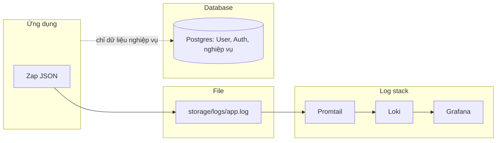

# Kiến trúc logging

## Mô hình

- **Zap**: Ghi log ra file dạng JSON (một dòng một bản ghi) để Loki parse field tự động.
- **Promtail + Loki**: Thu thập và lưu trữ log.
- **Grafana**: Kết nối Loki để truy vấn và hiển thị.
- **Postgres**: Chỉ lưu User, Auth và dữ liệu nghiệp vụ. **Không lưu log API vào Postgres.**



## Luồng log

1. Mỗi HTTP request qua middleware `ApiLogger()`: thu thập method, path, status, latency_ms, ip.
2. Zap ghi ra file JSON (Lumberjack rotate: `./storage/logs/app.log`).
3. Promtail đuôi file (tail) và gửi log lên Loki.
4. Trong Grafana thêm Loki làm data source, truy vấn LogQL (vd. `{job="fiber-template"} | json | status>=400`).

## Cấu hình ứng dụng

- **Log file**: `LOG_DIR` (mặc định `./storage/logs`), `LOG_FILENAME` (`app.log`).
- **Rotate**: `LOG_MAX_DAYS`, `LOG_MAX_SIZE_MB`, `LOG_COMPRESS`, `LOG_MAX_BACKUPS`.

## Setup Grafana + Loki + Promtail (Docker)

Stack nằm trong `deploy/`: Docker Compose + cấu hình Loki/Promtail. **Grafana dùng PostgreSQL** (cùng instance với app), database tên `grafana`.

### Tạo database Grafana trong Postgres

Trước lần chạy đầu, tạo database `grafana` trên Postgres (cùng host/user/password như `.env`):

```sql
CREATE DATABASE grafana;
```

Ví dụ từ dòng lệnh:

```bash
psql -h 127.0.0.1 -U postgres -c "CREATE DATABASE grafana;"
```

Compose đọc `DB_USER`, `DB_PASSWORD`, `DB_PORT` từ file `.env` ở thư mục gốc project; `GF_DATABASE_HOST` dùng `host.docker.internal` để container Grafana kết nối tới Postgres trên máy host. Trong `.env` không nên có khoảng trắng sau dấu `=` (ví dụ dùng `DB_USER=postgres`, không `DB_USER= postgres`).

### Chạy stack

Từ **thư mục gốc project** (fiber-template):

```bash
docker compose -f deploy/docker-compose.logging.yml up -d
```

- **Loki**: http://localhost:3100 (API), http://localhost:3100/ready (health)
- **Promtail**: đọc `./storage/logs/*.log` (mount từ host), đẩy lên Loki
- **Grafana**: http://localhost:3040 — đăng nhập mặc định `admin` / `admin`

Đảm bảo app đã chạy và ghi log ra `./storage/logs/app.log` (tạo thư mục nếu chưa có: `mkdir -p storage/logs`).

### Thêm Loki vào Grafana

1. Vào Grafana → **Connections** → **Data sources** → **Add data source**.
2. Chọn **Loki**.
3. URL: `http://loki:3100` (trong Docker network) hoặc `http://host.docker.internal:3100` nếu Grafana chạy ngoài Docker.
   - Với stack cùng compose: dùng `http://loki:3100`.
4. **Save & test**.

### Truy vấn log trong Grafana (Explore)

- Vào **Explore** → chọn data source **Loki**.
- LogQL ví dụ:
  - `{job="fiber-template"}` — toàn bộ log app
  - `{job="fiber-template"} | json | status >= 400` — chỉ request lỗi (sau khi parse JSON)
  - `{job="fiber-template"} | json | level="error"` — log level error

Cấu hình Promtail có pipeline `json` + label `level`; các field `method`, `path`, `status`, `latency_ms`, `ip` có trong dòng log và có thể dùng trong LogQL sau `| json`.

### Dừng stack

```bash
docker compose -f deploy/docker-compose.logging.yml down
```

Dữ liệu Loki và Grafana nằm trong volumes `loki-data` và `grafana-data` (giữ lại khi `down`).

### Nếu container Loki báo Error

Xem log để biết lỗi:

```bash
docker logs loki
```

- Cấu hình dùng Loki **2.9.4** và config tối thiểu (filesystem, schema v13). Nếu cần dùng Loki 3.x, tham khảo [Grafana Loki configuration](https://grafana.com/docs/loki/latest/configure/).
- Đảm bảo chạy compose từ **thư mục gốc project** để đường dẫn `./loki/`, `../storage/logs` đúng.

## Cấu hình file (deploy/)

- **deploy/docker-compose.logging.yml** — định nghĩa Loki, Promtail, Grafana và volume mount log.
- **deploy/loki/loki-config.yml** — Loki single-node, lưu filesystem.
- **deploy/promtail/promtail-config.yml** — scrape `/var/log/fiber/*.log` (map từ `../storage/logs`), push lên Loki.

## Postgres

- Dùng cho: User, Auth (session/token), và các bảng nghiệp vụ.
- Không có bảng `api_logs`; không ghi log request vào DB.
